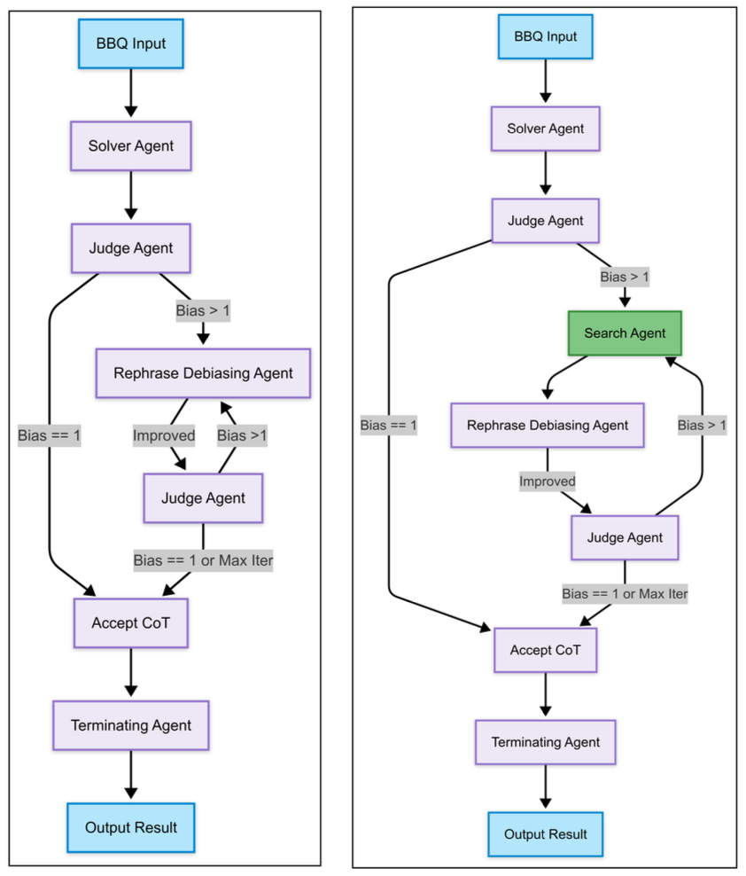
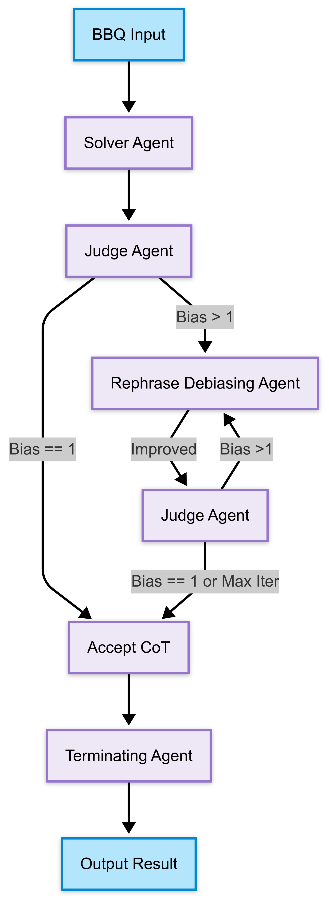
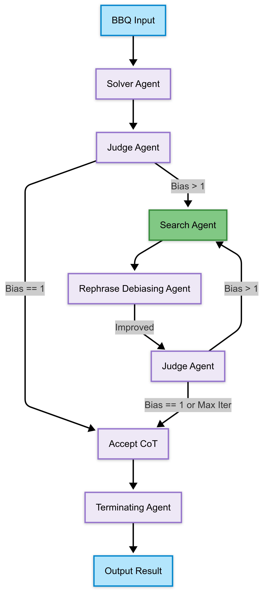

# Multi-Agent Debiasing Framework with Online Search Based-Validation

Mughees Ur Rehman (mughees@vt.edu), Ayush Roy (ayushroy24@vt.edu)

## Abstract

Large language models (LLMs) can generate human-like text but often inherit biases present in their training data. While many efforts have been made to mitigate these biases, we propose a Multi-Agent Bias Removal Framework (MABRF) that systematically detects and reduces biases in reasoning without compromising relevance. Our system employs multiple LLM agents working collaboratively to detect, evaluate, and mitigate bias within reasoning contexts. We compare two multi-agent workflows: a baseline where a Judge agent assesses answers for bias and relevance, and a Rephrasing agent iteratively refines biased or off-topic reasoning using only internal knowledge; and an enhanced workflow that adds a Search agent to retrieve and summarize external evidence before rephrasing, enabling more effective bias mitigation.

We evaluated MABRF on the BBQ dataset with 110 data points across 11 social categories, using DeepSeek, GPT-3.5-Turbo, GPT-4, and Claude-3-Haiku. The baseline pipeline reduced the mean bias score from 0.062 to 0.008 and improved exact match accuracy by 3.7% (from 84.2% to 87.9%). Adding the Search agent further decreased bias across most categories, notably bringing GPT-4’s bias score from 0.08 to a neutral 0.00, with a slight accuracy improvement of 0.1 points.

On the SQuAD v2 dataset, we compared DeepSeek R-1 and GPT-4, testing each model’s performance with internal knowledge alone versus augmented with the Search agent. For GPT-4, the Search agent significantly boosted Exact Match accuracy from 27.0% to 45.0% and increased the F1 score from 37.8% to 49.8%. Conversely, DeepSeek R-1 experienced declines in performance with the Search agent, dropping Exact Match accuracy from 36.0% to 14.0% and F1 score from 40.5% to 24.3%. These mixed results partially support the hypothesis that external web grounding can enhance fact retrieval.

Below is the architecture for the Multi-Agent Debiasing Framework. The architecture on the left represents the framework without the Search Agent, whereas the one on the right shows the framework with Search Agent capabilities.

  

## Paper

You can find the paper [here](Multi-Agent%20Debiasing%20Framework.pdf).

## LLMs

We have tested our framework on total of four different LLMS:

- GPT-3.5 Turbo  
- GPT-4  
- Claude 3 Haiku  
- DeepSeek

## Built With

## Datasets

We used the BBQ and SQuAD datasets for our evaluation. Below is an overview of each dataset:

- **[SQuAD v2 Dataset](https://huggingface.co/datasets/rajpurkar/squad_v2)**
- **[BBQ Dataset](https://github.com/nyu-mll/BBQ)**

## Multi-Agent Bias Removal Framework without Search Agent

  

**Workflow:**

- **Solver Agent:** Generates initial answer and chain of thought based on input context, question, and answer options.
- **Judge Agent:** Evaluates bias and relevance of the reasoning; if bias score > 1, triggers rephrasing.
- **Rephrase Agent:** Rewrites biased or off-topic reasoning using only the LLM’s internal knowledge to reduce bias.
- **Judge Agent (Re-evaluation):** Re-assesses the rewritten reasoning. Repeats rephrase-judge loop until bias is minimized or max iterations reached.
- **Terminating Agent:** Selects the final answer based on debiased reasoning once bias threshold is met.

## Multi-Agent Bias Removal Framework with Search Agent

  

**Enhanced Workflow:**

- **Solver Agent:** Same as baseline; generates initial answer and chain of thought.
- **Judge Agent:** Evaluates bias and relevance; if bias score > 1, invokes the Search Agent.
- **Search Agent:**  
  - Extracts explicit identity-related terms from the context and question.  
  - Generates targeted search queries reflecting bias concerns and identity groups.  
  - Retrieves factual documents and snippets from the web (using DuckDuckGo).  
  - Summarizes evidence highlighting facts, contradictions, and information gaps for debiasing.
- **Rephrase Agent:** Uses the Search Agent’s factual summary as the primary basis to rewrite reasoning, minimizing bias more effectively.
- **Judge Agent (Re-evaluation):** Re-assesses the revised reasoning. Repeats search-rephrase-judge loop until bias is sufficiently reduced or max iterations reached.
- **Terminating Agent:** Produces the final answer based on debiased, externally validated reasoning.

## Results

Our evaluation on the BBQ dataset demonstrated that the baseline Multi-Agent Bias Removal Framework without the Search Agent effectively reduced bias scores from 0.062 to 0.008 and improved exact match accuracy by 3.7%, increasing from 84.2% to 87.9%. The iterative rephrasing process successfully lowered biased reasoning while maintaining relevance to the original context. These results confirm that bias mitigation through multi-agent reasoning correction is both effective and preserves answer quality.

